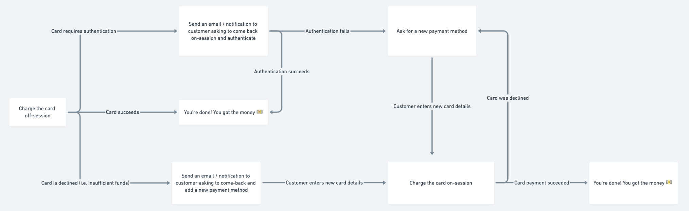
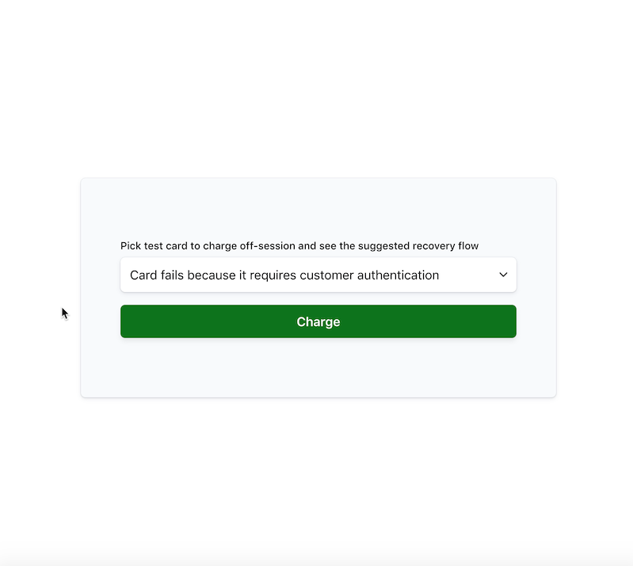

# Charging a saved card

When you create a PaymentIntent with a saved card there's a risk that the card will be declined or require authentication.
You should build a recovery flow to prompt your customer to either authenticate the purchase or provide new payment details.

Some examples of recovery flows include:

* Sending an email asking the customer to return to your website
* Pushing an app notification asking the customer to return to your application
* Trying to use a backup payment method saved to the Customer

This sample uses three Stripe test cards to demonstrate the three different flows you will have to plan for when charging a saved card:

1. Card fails because it requires customer authentication - Reuse the PaymentIntent and PaymentMethod to have the customer authenticate the payment.

2. Card fails due to insufficient funds - Reuse the PaymentIntent but ask the customer to enter new payment method details.

3. Card succeeds - No recovery flow needed! The payment went through.

Before you charge a saved card you need to collect card details and save them to a Customer. See [our docs](/docs/payments/save-and-reuse) or [sample](https://github.com/stripe-samples/saving-card-without-payment) on saving cards.



**Demo**

See the sample [live](https://lbbjp.sse.codesandbox.io/) in test mode or [fork](https://codesandbox.io/s/stripe-sample-charging-saved-card-lbbjp) the Node implementation on CodeSandbox.



Pick a test card from the dropdown to attempt to charge "off-session" on the server. The sample will present a "recovery flow" for cards that are declined or require authentication.

When prompted to add a new payment method, you can use these test cards:

Use the `4242424242424242` test card number with any CVC, postal code and future expiration date will succeed.

Use the `4000000000003220` test card number with any CVC, postal code and future expiration date will require authentication.

Read more about testing on Stripe at https://stripe.com/docs/testing.


## How to run locally

This sample includes 5 server implementations in Node, Ruby, Python, Java, and PHP.

Follow the steps below to run locally.

**1. Clone and configure the sample**

The Stripe CLI is the fastest way to clone and configure a sample to run locally.

**Using the Stripe CLI**

If you haven't already installed the CLI, follow the [installation steps](https://github.com/stripe/stripe-cli#installation) in the project README. The CLI is useful for cloning samples and locally testing webhooks and Stripe integrations.

In your terminal shell, run the Stripe CLI command to clone the sample:

```
stripe samples create charging-a-saved-card
```

The CLI will walk you through picking your integration type, server and client languages, and configuring your .env config file with your Stripe API keys.

**Installing and cloning manually**

If you do not want to use the Stripe CLI, you can manually clone and configure the sample yourself:

```
git clone https://github.com/stripe-samples/charging-a-saved-card.git
```

Copy the .env.example file into a file named .env in the folder of the server you want to use. For example:

```
cp .env.example server/node/.env
```

You will need a Stripe account in order to run the demo. Once you set up your account, go to the Stripe [developer dashboard](https://stripe.com/docs/development/quickstart#api-keys) to find your API keys.

```
STRIPE_PUBLISHABLE_KEY=<replace-with-your-publishable-key>
STRIPE_SECRET_KEY=<replace-with-your-secret-key>
```

`STATIC_DIR` tells the server where to the client files are located and does not need to be modified unless you move the server files.

**2. Follow the server instructions on how to run:**

Pick the server language you want and follow the instructions in the server folder README on how to run.

For example, if you want to run the Node server in `using-webhooks`:

```
cd server/node # there's a README in this folder with instructions
npm install
npm start
```

**4. [Optional] Run a webhook locally:**

If you want to test the `using-webhooks` integration with a local webhook on your machine, you can use the Stripe CLI to easily spin one up.

First [install the CLI](https://stripe.com/docs/stripe-cli) and [link your Stripe account](https://stripe.com/docs/stripe-cli#link-account).

```
stripe listen --forward-to localhost:4242/webhook
```

The CLI will print a webhook secret key to the console. Set `STRIPE_WEBHOOK_SECRET` to this value in your .env file.

You should see events logged in the console where the CLI is running.

When you are ready to create a live webhook endpoint, follow our guide in the docs on [configuring a webhook endpoint in the dashboard](https://stripe.com/docs/webhooks/setup#configure-webhook-settings).


## FAQ
Q: Why did you pick these frameworks?

A: We chose the most minimal framework to convey the key Stripe calls and concepts you need to understand. These demos are meant as an educational tool that helps you roadmap how to integrate Stripe within your own system independent of the framework.

## Get support
If you found a bug or want to suggest a new [feature/use case/sample], please [file an issue](../../issues).

If you have questions, comments, or need help with code, we're here to help:
- on [Discord](https://stripe.com/go/developer-chat)
- on Twitter at [@StripeDev](https://twitter.com/StripeDev)
- on Stack Overflow at the [stripe-payments](https://stackoverflow.com/tags/stripe-payments/info) tag
- by [email](mailto:support+github@stripe.com)

Sign up to [stay updated with developer news](https://go.stripe.global/dev-digest).

## Author(s)
[@adreyfus-stripe](https://twitter.com/adrind)
